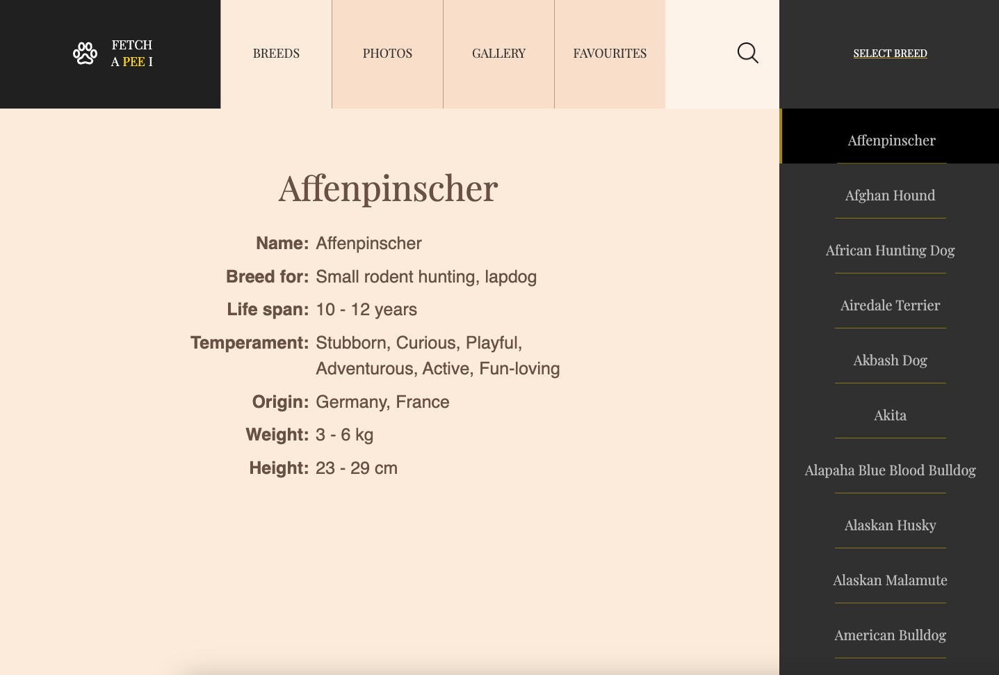
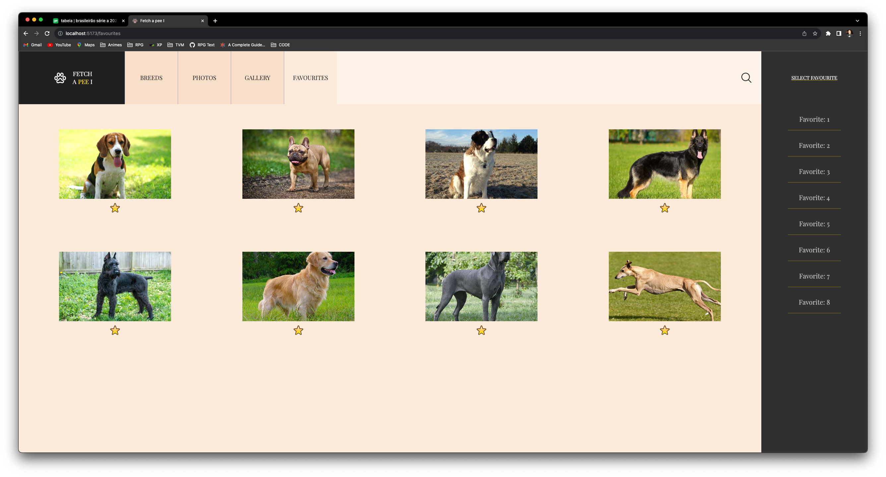
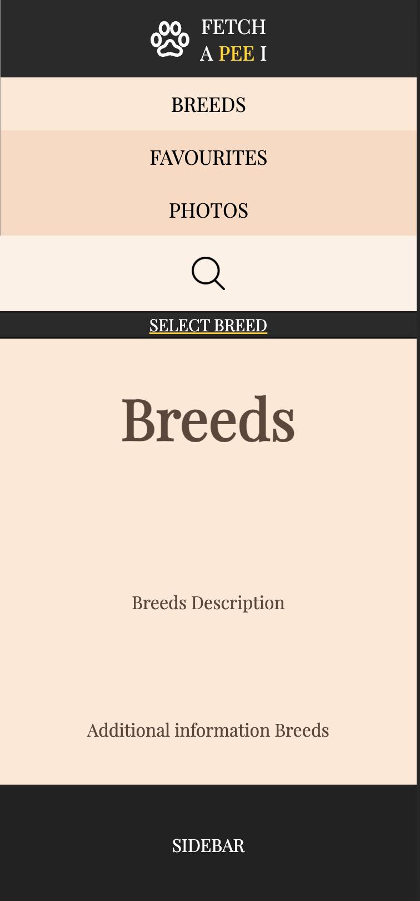

# Fetch a Pee

This project was developed during the Mindera Frontend Bootcamp at 2023.
The idea is to create a page to interect with a Dog API.

## How to run

```bash
yarn install
yarn dev
```

## Tasks

- [x] Project Foundation
- [x] Handle API
- [x] Visual Identity
- [x] Landing Page
- [x] Breeds
- [x] Photos
- [x] Gallery
- [x] Favourites

## Team Members

- [Bruno Machado](https://github.com/brunomachadors)
- [Francisco Carvalhal](https://github.com/FCarvalhal)

## OUR DOGS

### PANTUFA


### LIRA


### DOG API

- [DOG API](https://www.thedogapi.com/)
- [Documentation](https://developers.thedogapi.com/view-account/ylX4blBYT9FaoVd6OhvR?report=8FfZAkNzs)
- [Postman Collection](https://documenter.getpostman.com/view/5578104/2s935hRnak)

## All packages

### React + Vite

This template provides a minimal setup to get React working in Vite with HMR and some ESLint rules.

Currently, two official plugins are available:

- [@vitejs/plugin-react](https://github.com/vitejs/vite-plugin-react/blob/main/packages/plugin-react/README.md) uses [Babel](https://babeljs.io/) for Fast Refresh
- [@vitejs/plugin-react-swc](https://github.com/vitejs/vite-plugin-react-swc) uses [SWC](https://swc.rs/) for Fast Refresh

### AXIOS

This project is using action as a method of comunication with the endpoins.

- [Axios Oficial Page](https://axios-http.com/docs/intro)

### STYLED COMPOMENTS

Almost all compoments are using styled compoments
[Style Compoments Website](https://styled-components.com/)

### PROP TYPES

Runtime type checking for React props and similar objects.

You can use prop-types to document the intended types of properties passed to components. React (and potentially other libraries—see the checkPropTypes() reference below) will check props passed to your components against those definitions, and warn in development if they don’t match.

[Prop Types](https://www.npmjs.com/package/prop-types)

### REDUX

This project was made using Redux. Redux provides a central store to hold the state, and any component can access and subscribe to this store to stay informed about state changes.

You can use Redux for managing the state of a web application. It follows a predictable state management pattern, where the entire application state is stored in a single JavaScript object, and changes to the state are made through actions.
These actions are dispatched by components and processed by reducers, which are pure functions responsible for updating the state.

[Redux Website](https://redux.js.org/)

## PREVIEW

### LANDING PAGE


### BREEDS



### FAVOURITES



### MOBILE


